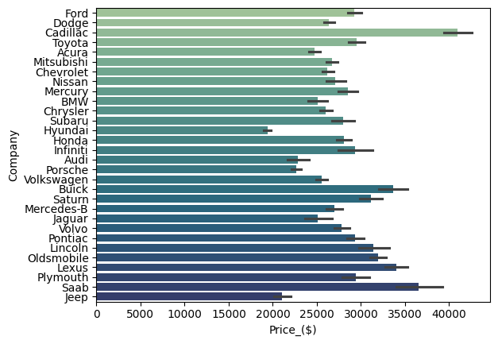
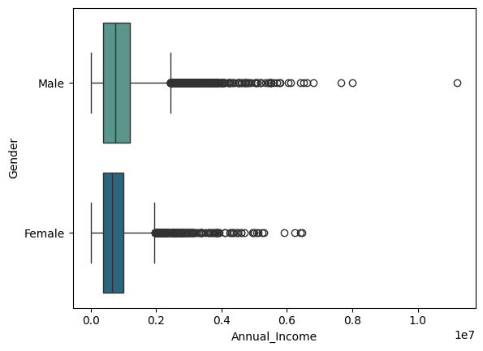
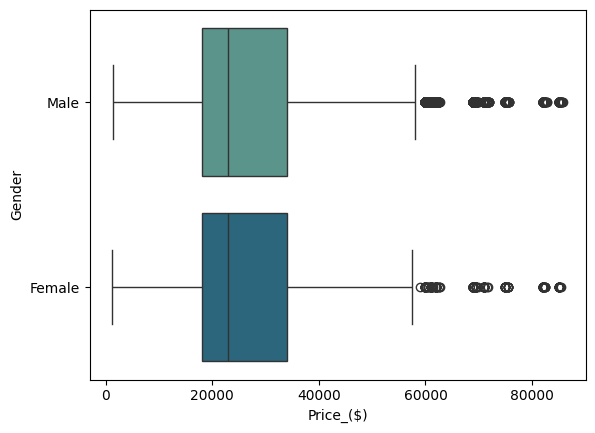
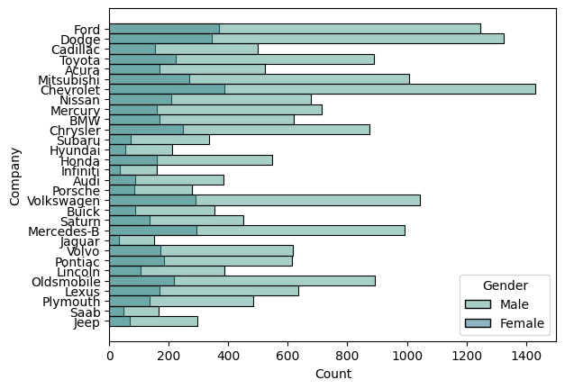
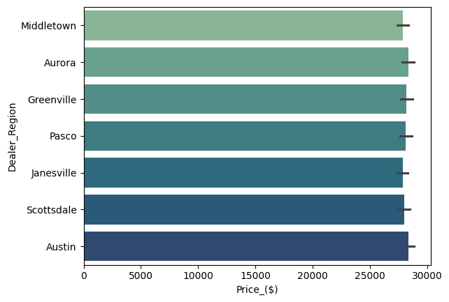
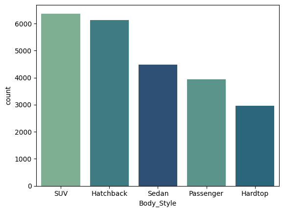
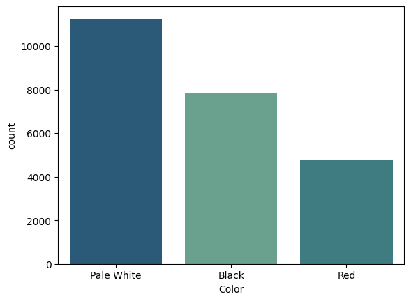
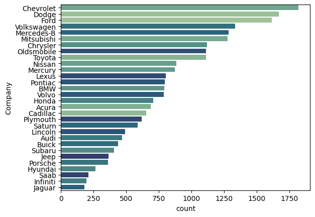
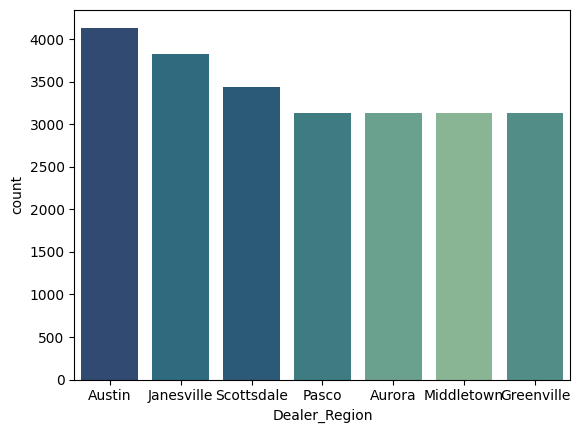

# Exploratory Data Analysis in Python

The purpose of the project is to give insight on overall trends on the car sales of regional dealerships and to investigate what preferences different customers have when purchasing a vehicle.


## Data Set Used

 - [Car Sales Report](https://www.kaggle.com/datasets/missionjee/car-sales-report/data)
## Environment Used

- VM inside of VS Code running ```Python3```

- ```Jupyter Notebook``` inside of VS Code


## Libraries Used
```
- pandas
- matplotlib
- seaborn
```
## Some Findings

- #### Number of...
  - Cars sold per Dealer Region \
  
  - Males and Females who bought from each company \
  
  - Cars that were sold from each company\
  
- #### Average
  - Price a Male and Female are paying for a car \
  
  - Annual Income between Males and Females \
  
  - Price of a Car per Company \
  
  - Price of a Car per Dealer Region \
  
- #### Most Common Type of...
  - Color bought \
  
  - Body Style bought \
  
